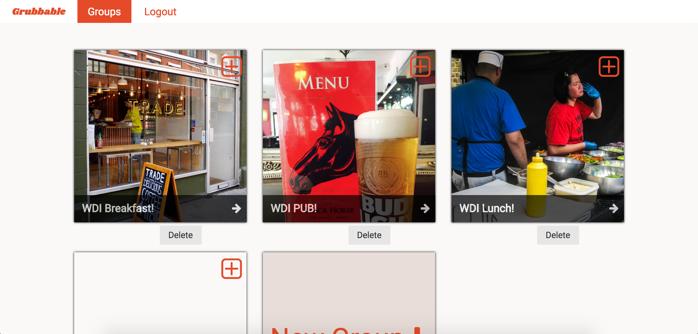
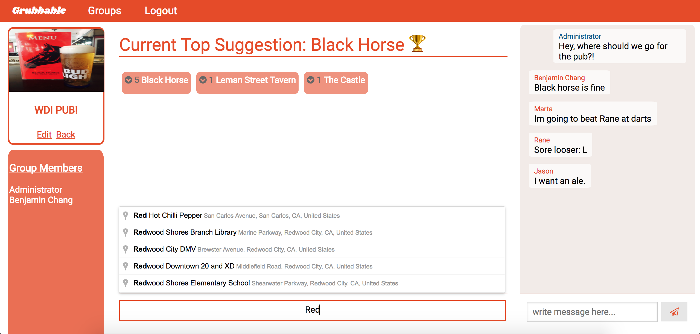
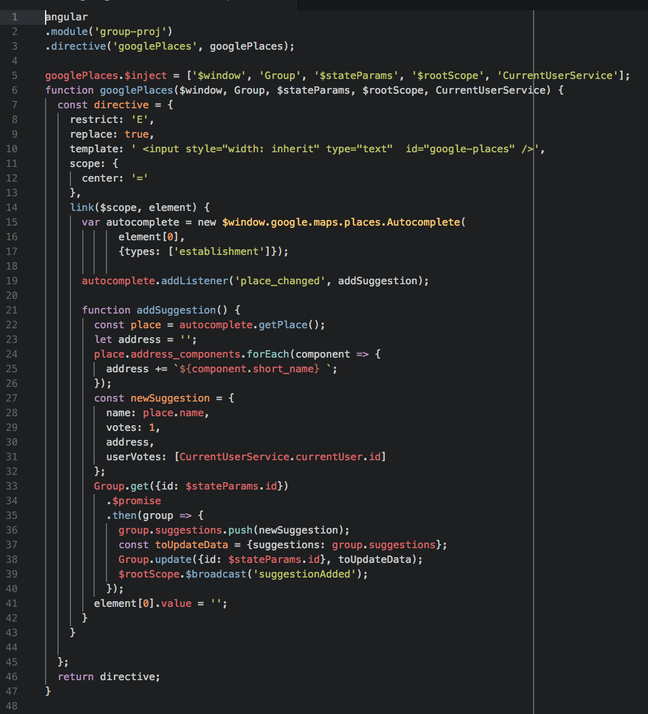

# WDI-group-project-3

## Grubbable

[Open Grubbable Online](http://grubbable-app.herokuapp.com)

Grubbable is a group polling app to help you and your friends decide where to go for lunch! (or the pub...) The app aims to help end those constant debates in the break room to finally end the gridlock on where to go eat that chicken ceasar wrap once and for all!

### Technologies used

- express
- MongoDB
- mongoose
- AngularJS
- Node.js
- bcrypt
- JsonWebTokens
- SCSS/Sass

### Layout

The groups index is a pretty simple grid of groups that the user can join and start conversations in, similar to Trello.

The groups show was inspired by WhatsApp and Trello, but ended up following a dashboard like layout similar to Facebook's timeline.

One of the more difficult aspects was the layout, as it was difficult to get the group show to be the same on every screen we tested the website on.

### External Google Places API

We used the Google Places API to find places nearby for the group to poll on. It runs on an Angular directive.

